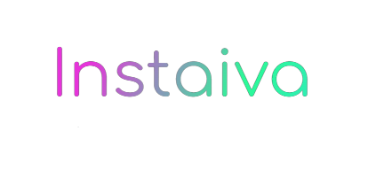

<div id="top"></div>


<!-- PROJECT LOGO -->
<br />
<div align="center">
    

  <h3 align="center">Instaiva</h3>

  <p align="center">
    A free and OpenSource Instagram DP downloader.
    <br />
    <br />
    <a href="https://Instaiva.js.org/">View Demo</a>
    ·
    <a href="https://github.com/7orp3do/instaiva/issues">Report Bug</a>
    ·
    <a href="https://github.com/7orp3do/instaiva/issues">Request Feature</a>
  </p>
</div>


<!-- ABOUT THE PROJECT -->
## About The Instaiva

<!-- [![Product Name Screen Shot][product-screenshot]](https://example.com) -->

There are many other Instagram Downloaders are available on the Internet however they are all full of ads so I made this a free and simple Instagram downloader. I made it with the help of [instagram-web-api](https://www.npmjs.com/package/instagram-web-api). Currently it has only option to download profile picture but more options will be added soon. and If you like it, please consider giving this repo a ⭐.

### Upcoming Features

- [x] Profile Pictures Downloader
- [ ] Instagram Reels Downloader
- [ ] Instagram Stories Downloader

<p align="right">(<a href="#top">back to top</a>)</p>

## API

- ### Fetch Profile
    ```rest
    https://instaiva.herokuapp.com/api/profile/:username
    ```
    Example Response:
    ```json
    {
       "followers": 497971008,
       "following": 120,
       "posts": 7115,
       "biography": "Discover what's next on Instagram 🔎✨",
       "blocked_by_viewer": false,
       "restricted_by_viewer": false,
       "country_block": false,
       "external_url": "http://help.instagram.com/",
       "fbid": "17841400039600391",
       "followed_by_viewer": false,
       "follows_viewer": false,
       "full_name": "Instagram",
       "has_ar_effects": false,
       "has_clips": true,
       "has_guides": true,
       "has_channel": false,
       "has_blocked_viewer": false,
       "highlight_reel_count": 14,
       "has_requested_viewer": false,
       "hide_like_and_view_counts": true,
       "id": "25025320",
       "is_business_account": false,
       "is_professional_account": true,
       "is_supervision_enabled": false,
       "is_guardian_of_viewer": false,
       "is_supervised_by_viewer": false,
       "is_embeds_disabled": false,
       "is_joined_recently": false,
       "business_contact_method": "UNKNOWN",
       "category_name": "Digital creator",
       "is_private": false,
       "is_verified": true,
       "requested_by_viewer": false,
       "should_show_category": false,
       "should_show_public_contacts": false,
       "username": "instagram",
       "profile_pic_url": "https://instaiva.herokuapp.com/media/ aHR0cHM6Ly9zY29udGVudC1tc3AxLTEuY2RuaW5zdGFncmFtLmNvbS92L3Q1MS4yODg1LTE5LzIwMzAxOTA4N18zOTY5NTMwNzQ2NTAwNzg2Xzc5MzA1OTY2Mzk5MTYyMzU5NjJfbi5qcGc/c3RwPWRzdC1qcGdfczMyMHgzMjAmX25jX2h0PXNjb250ZW50LW1zcDEtMS5jZG5pbn0YWdyYW0uY29tJl9uY19jYXQ9MSZfbmNfb2hjPTY0d3phRzlrcTZzQVg5Z2ZQWC0mZWRtPUFCZmQwTWdCQUFBQSZjY2I9Ny00Jm9oPTAwX0FULTlIOUZRbmVQbEJGVDl2Y2k4cV9vZ2UxRnBXenBLdGNHeG9vUUNJVkdhNUEmb2U9NjI2Qzc0QzImX25jX3NpZD03YmZmODM=",
       "profile_pic_url_instagram": "https://scontent-msp1-1.cdninstagram.com/v/t51.2885-19/203019087_3969530746500786_7930596639916235962_n.jpg?stp=dst-jpg_s320x320&_nc_ht=scontent-msp1-1.cdninstagram.com&_nc_cat=1&_nc_ohc=64wzaG9kq6sAX9gfPX-&edm=ABfd0MgBAAAA&ccb=7-4&oh=00_AT-9H9FQnePlBFT9vci8q_oge1FpWzpKtcGxooQCIVGa5A&oe=626C74C2&_nc_sid=7bff83" 
    }
    ```


<!-- CONTRIBUTING -->
## Contributing

Contributions are what make the open source community such an amazing place to learn, inspire, and create. Any contributions you make are **greatly appreciated**.

If you have a suggestion that would make this better, please fork the repo and create a pull request. You can also simply open an issue with the tag "enhancement".
Don't forget to give the project a star! Thanks again!

1. Fork the Project
2. Create your Feature Branch (`git checkout -b feature/AmazingFeature`)
3. Commit your Changes (`git commit -m 'Add some AmazingFeature'`)
4. Push to the Branch (`git push origin feature/AmazingFeature`)
5. Open a Pull Request

<p align="right">(<a href="#top">back to top</a>)</p>


<!-- LICENSE -->
## License

Distributed under the GPL License. See `LICENSE.txt` for more information.

<p align="right">(<a href="#top">back to top</a>)</p>


<!-- ACKNOWLEDGMENTS -->
## Acknowledgments

* [Instagram-web-api](https://www.npmjs.com/package/instagram-web-api)
* [Img Shields](https://shields.io)
* [GitHub Pages](https://pages.github.com)
* [Font Awesome](https://fontawesome.com)

<p align="right">(<a href="#top">back to top</a>)</p>